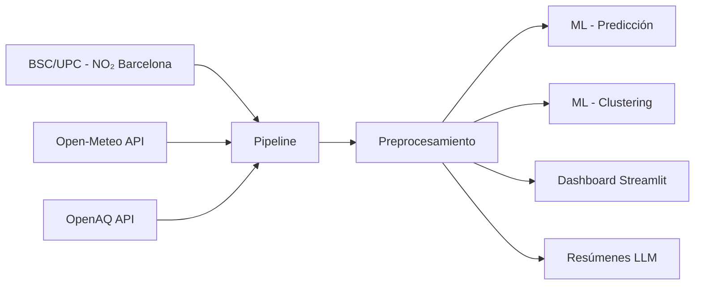

# 🌍 Monitor de Calidad del Aire y Datos Ambientales

**Grupo 6** - Gestión de la Información - I Semestre 2026
Universidad Tecnológica de Panamá

## 📋 Descripción

Sistema de monitoreo de calidad del aire que integra datos del **Barcelona Supercomputing Center (BSC-CNS)** asociado a la **Universitat Politècnica de Catalunya (UPC)** de España, junto con APIs públicas de calidad del aire. Aplica Machine Learning para predicción de tendencias y clustering de estaciones, con un dashboard interactivo en Streamlit.

## 🏛️ Fuente Principal: BSC / Universitat Politècnica de Catalunya (España)

Los datos provienen del **Barcelona Supercomputing Center - Centro Nacional de Supercomputación (BSC-CNS)**, centro de I+D asociado a la **Universitat Politècnica de Catalunya (UPC)**.

- **Dataset:** Street- and census-level NO₂ data for Barcelona with uncertainty
- **Publicado en:** Nature Scientific Data (2026) - DOI: [10.1038/s41597-026-06592-x](https://www.nature.com/articles/s41597-026-06592-x)
- **Datos:** 6 años (2019-2024) de NO₂ diario a nivel de calle (25m x 25m) y censal
- **Plataforma:** [uncertAIR](https://earth.bsc.es/shiny/uncertAIR/)
- **Zenodo:** [10.5281/zenodo.16737066](https://doi.org/10.5281/zenodo.16737066)

### Fuentes adicionales

| Fuente | Descripción | API Key |
|---|---|---|
| [Open-Meteo](https://open-meteo.com/en/docs/air-quality-api) | CAMS/Copernicus - PM2.5, PM10, NO₂, O₃, SO₂, CO, AQI | No requiere |
| [OpenAQ](https://docs.openaq.org) | Estaciones de monitoreo globales (incluye España) | Gratuita |

## 🚀 Requisitos

- Python 3.10+
- pip

## 📦 Instalación

```bash
# Clonar el repositorio
git clone <url-del-repo>
cd parcial2-grupo6

# Instalar dependencias
pip install -r requirements.txt

# Configurar variables de entorno (opcional)
cp .env.example .env
# Editar .env con tus API keys si es necesario
```

## 🔄 Pipeline de Datos



### 1. Ingesta de datos

```bash
# Fuente 1: Datos BSC/UPC (Barcelona NO₂ 2019-2024)
python src/pipeline/ingest_bsc.py

# Fuente 2: Open-Meteo Air Quality API
python src/pipeline/ingest_openmeteo.py

# Fuente 3: OpenAQ API (opcional)
python src/pipeline/ingest_openaq.py
```

### 2. Preprocesamiento

```bash
python src/pipeline/preprocess.py
```

### 3. Machine Learning

```bash
# Predicción de tendencias (Random Forest)
python src/ml/predict.py

# Clustering de estaciones (K-Means)
python src/ml/cluster.py
```

### 4. Dashboard

```bash
streamlit run src/dashboard/app.py
```

### 5. Resúmenes con IA

```bash
python src/llm/summaries.py
```

## 📊 Dashboard

El dashboard incluye:

- **📊 Visión General** - KPIs y estadísticas principales
- **🗺️ Mapas Interactivos** - Estaciones de monitoreo en Folium + mapas de calor
- **📈 Tendencias** - Series temporales y correlaciones
- **🤖 Predicciones ML** - Random Forest con métricas y pronóstico
- **📄 Resúmenes IA** - Reportes generados por LLM
- **ℹ️ Acerca del Proyecto** - Documentación y referencias

## 📁 Estructura del Proyecto

```
parcial2-grupo6/
├── README.md
├── requirements.txt
├── .env.example
├── data/
│   ├── raw/            # Datos crudos de APIs
│   ├── processed/      # Datos limpios y transformados
│   └── external/       # Datos BSC/Zenodo
├── src/
│   ├── pipeline/       # Módulos de ingesta y preprocesamiento
│   │   ├── ingest_bsc.py        # Ingesta BSC/UPC
│   │   ├── ingest_openmeteo.py  # Ingesta Open-Meteo
│   │   ├── ingest_openaq.py     # Ingesta OpenAQ
│   │   └── preprocess.py        # Preprocesamiento
│   ├── ml/             # Modelos de ML
│   │   ├── predict.py           # Random Forest (regresión)
│   │   └── cluster.py           # K-Means (clustering)
│   ├── dashboard/      # Dashboard Streamlit
│   │   └── app.py               # Aplicación principal
│   ├── llm/            # Resúmenes con IA
│   │   └── summaries.py         # Generación de reportes
│   └── utils/          # Utilidades
│       └── maps.py              # Mapas Folium
├── models/             # Modelos entrenados
├── reports/            # Reportes generados
├── docs/               # Documentación adicional
└── notebooks/          # Notebooks exploratorios
```

## ✅ Evaluación

| Componente | Peso | Estado |
|---|---|---|
| Pipeline de datos | 30% | ✅ |
| Análisis ML | 25% | ✅ |
| Visualización/Dashboard | 25% | ✅ |
| Documentación | 20% | ✅ |
